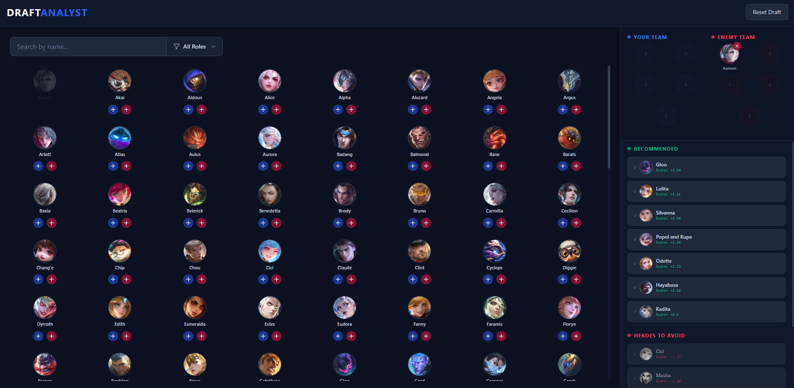
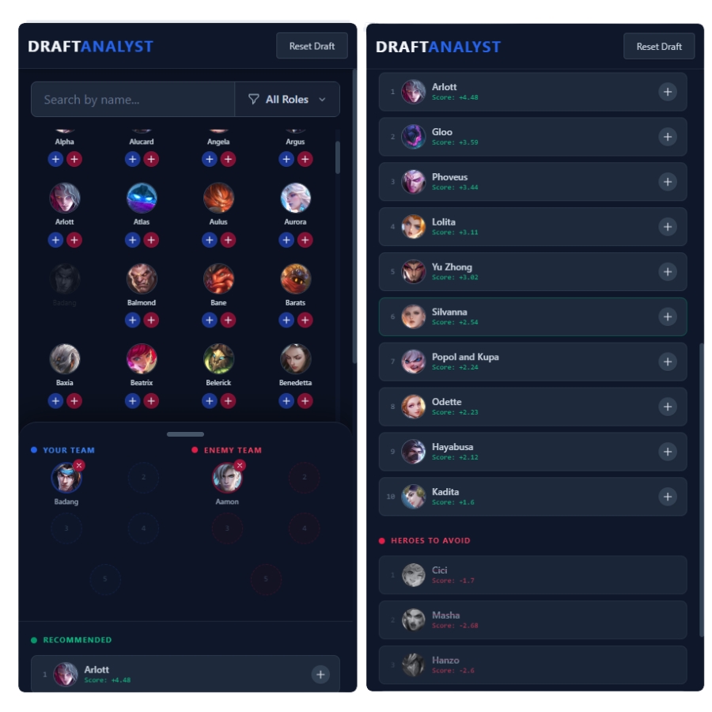

  

  <h1>MetaDawn MLBB | Advanced Draft Analyst</h1>

  

    
    
  

**MetaDawn** is a live, automated esports data-analytics platform designed to calculate optimal drafting synergies and counter-picks for Mobile Legends: Bang Bang.

**Crucially, all recommendation scores and matchup data are derived purely from live global win-rate statistics provided directly by the official MLBB website.** By stripping away subjective tier-lists and relying strictly on mathematical win-deltas, the platform provides objective, data-driven draft advantages.

*Note: The core codebase is currently hosted in a private repository to protect the scraping algorithms and database integrity. This repository serves as an architectural overview and public access point.*

## Live Demo
Access the live Command Center here: **[metadawn.onrender.com](https://metadawn.onrender.com)**

## The Scoring Algorithm
MetaDawn evaluates the live draft state using official Moonton metrics to generate two distinct data pipelines:
* **Recommended Picks (Net Score):** Calculates the combined value of a hero countering the enemy draft, subtracting how hard they are countered by the enemy draft, and adding their statistical synergy score with locked-in allies.
* **Heroes to Avoid (Hazard Score):** A strict, isolated calculation of how badly a hero is countered by the current enemy lineup, serving as an immediate hazard warning against easily shut-down picks.

## System Architecture
This application features a fully automated, zero-maintenance cloud pipeline:
* **The Web Server (Render):** A custom Dockerized PHP/Laravel environment serving the frontend UI and API endpoints. It utilizes an artificially simulated keep-awake polling system to bypass cold-starts.
* **The Database (TiDB Cloud):** A highly secure, serverless MySQL cluster utilizing TLS-encrypted connections.
* **The Automation Engine (GitHub Actions):** A cron-triggered CI/CD pipeline that boots a headless Chrome browser (`Laravel Dusk`) every night at midnight UTC. It autonomously scrapes live global win rates from the official Moonton API, calculates shifting meta trends, and injects the updated synergy data directly into the live TiDB database.

## Tech Stack
* **Backend:** Laravel 11, PHP 8.2
* **Frontend:** Tailwind CSS, Blade Templating, Vanilla JS
* **Database:** TiDB Serverless (MySQL)
* **Automation:** GitHub Actions, Laravel Dusk (Headless Chrome)
* **Deployment:** Render (Dockerized)

## Desktop Preview

## Mobile Preview

